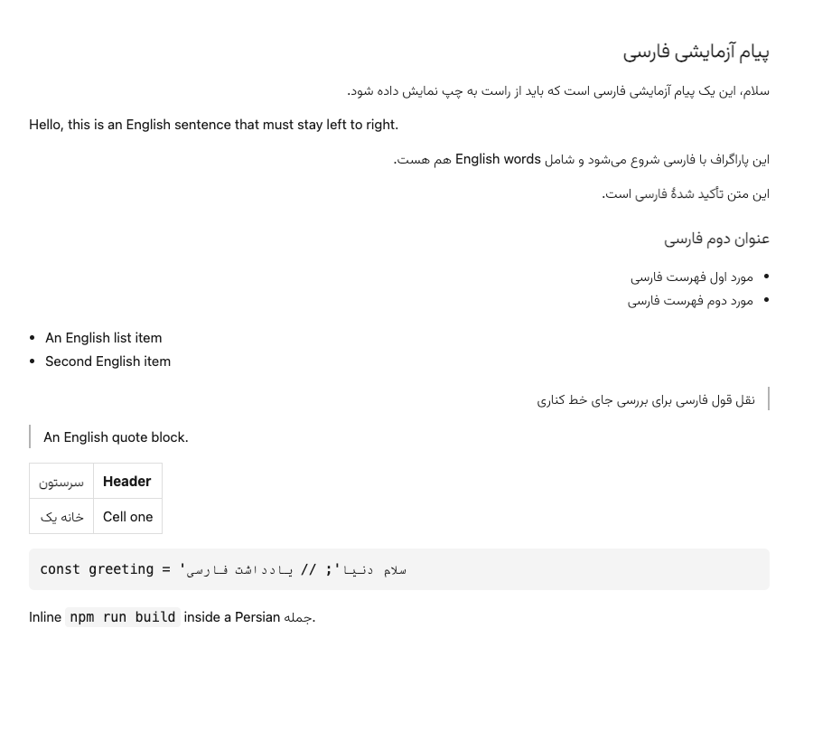

# dsh-rtl-persian

**Bidirectional Persian/Arabic text and Vazirmatn typography for the [DeepSeek Harness](https://github.com/deepseek-ai/deepseek-harness) (`dsh`) Web GUI.**

[](LICENSE)
[](https://nodejs.org)
[](https://github.com/deepseek-ai/deepseek-harness)
[](THIRD-PARTY-NOTICES.md)



---

## The problem

The `dsh` Web GUI is an LTR surface. Write to it in Persian and everything that
depends on direction goes wrong:

| Symptom | Cause |
| --- | --- |
| Paragraphs hug the left edge and read ragged | base direction is `ltr` |
| List markers and blockquote rules sit on the opposite side from the text | the markdown sheet hardcodes `padding-left` / `border-left` |
| Persian falls back to a Latin-first stack and renders in a substitute face | the surface's font stack has no Arabic-script family |
| Mixed messages look broken | one global direction cannot serve two scripts |

Flipping the whole GUI to RTL is not the answer — the English UI chrome around
the content would flip with it. What is needed is a surface that is
**bidirectional**: every text block resolves its own direction, and only
Arabic-script runs change typeface.

## What this does

- **Per-block direction.** Each text block takes the direction of its own first
  strong character, so a Persian paragraph is RTL and an English one stays LTR —
  in the same conversation, in the same document.
- **Mirrored physical sides.** Persian lists and blockquotes put their indent,
  marker, and rule on the right; English ones are left exactly as the surface
  drew them.
- **Persian-only font.** Vazirmatn is attached through `unicode-range`, so it is
  used for Arabic-script codepoints and *never* for Latin letters or digits.
- **English untouched.** The UI chrome, code blocks, and inline code keep their
  own typeface and direction.
- **No patches to `dsh`.** It is an ordinary composition row: a handful of CSS
  rules, one stylesheet, one small browser script.

## Install

`dsh` composes the Web surface from a host composition plus a patch layer you
own. Installation is two steps.

### 1. Install the plugin

Clone the repository into your Web profile's `plugins` directory:

```sh
git clone https://github.com/amiryavand/dsh-rtl-persian.git \
  "${DSH_HOME:-$HOME/.dsh}/profiles/web/plugins/dsh-rtl"
```

<details>
<summary>Prefer to install by hand?</summary>

Copy these four files into `${DSH_HOME:-$HOME/.dsh}/profiles/web/plugins/dsh-rtl/`:

```
plugin.mjs
rtl.js
vazirmatn-extralight.woff2
package.json
```

</details>

### 2. Mount the row

Add this entry to `${DSH_HOME:-$HOME/.dsh}/profiles/web/cordis.patch.yml`
(see [`examples/cordis.patch.yml`](examples/cordis.patch.yml) for a documented
copy):

```yaml
- insert:
    - id: dsh-rtl-persian
      name: './plugins/dsh-rtl/plugin.mjs'
```

The Web profile ships `patchReload: live`, so adding a **new** row takes effect
without a restart. Reload the browser page and Persian renders right-to-left.

> **Editing an installed plugin?** Node caches ES modules by URL, so changing the
> *content* of `plugin.mjs` needs a `dsh web` restart (or a new file name) before
> the new code runs. Adding, removing, or reconfiguring the row does not.

## Configuration

All three keys are optional and default to `true`.

```yaml
- insert:
    - id: dsh-rtl-persian
      name: './plugins/dsh-rtl/plugin.mjs'
      config:
        font: false        # keep the surface's own typeface for Persian
        direction: false   # keep the surface LTR
```

| Key | Type | Default | Effect |
| --- | --- | --- | --- |
| `enabled` | boolean | `true` | Master switch. When `false`, the row mounts nothing at all. |
| `font` | boolean | `true` | Serve and apply the Vazirmatn face. |
| `direction` | boolean | `true` | Inject the direction CSS and the `dir="auto"` browser script. |

Set `enabled: false` (or delete the entry) to switch everything off; both asset
routes and both index taps are unregistered with the row's fiber.

## How it works

Three mechanisms, deliberately layered so each one is useful on its own.

### 1. The stylesheet reaches the page after everything else

The plugin owns no client bundle. It appends a `<style>` element and a deferred
`<script>` to the end of `<head>` through the webserver's raw index tap
(`ctx.webServer.tapIndex`), which runs after the structured injection rows. That
guarantees the rules land **after** the surface's linked stylesheet — so on equal
specificity, they win.

The `--dsw-font-family` override is the one exception that cannot rely on
document order: the theme plugin injects its own `:root { --dsw-font-family: … }`
at runtime, *later* in the document. The override therefore outranks it on
specificity — `html:root` beats `:root` — and one token retypes the whole
surface, because every component either reads that token or inherits the result.

### 2. `dir="auto"` on leaves, `:has()` on containers

A small browser script (`rtl.js`) marks text blocks with `dir="auto"` and watches
for added nodes with a `MutationObserver`, coalescing work into animation frames
so streaming assistant output costs almost nothing.

Two subtleties shaped the current design:

- **Containers are not annotated.** The HTML `auto` algorithm ignores text inside
  any descendant that carries its own `dir`. A `<ul>` whose `<li>` children are
  annotated therefore resolves **LTR** — worse than leaving it alone. Containers
  are reached from the stylesheet with `:has(li:dir(rtl))` instead, which asks the
  same question without depending on the container's own direction.
- **`:dir()`, not `[dir="rtl"]`.** The script writes `dir="auto"`; the browser
  resolves the *direction*. `:dir(rtl)` matches the resolved value, so the mirror
  rules fire for exactly the elements that resolved RTL — and keep firing while
  streaming text changes direction mid-answer.

Explicitly-directed markup is never touched, and anything inside `pre`, `code`,
`kbd`, or `samp` is skipped, so source code stays LTR.

### 3. A font that can only be used for Persian

Vazirmatn is attached with `unicode-range` limited to Arabic-script codepoints,
and pinned to a single weight. Latin letters, Latin digits, and symbols fall
straight through to the next family in the stack.

Pinning matters: because the face is the only one in its family, a component
asking for weight 600 still gets the bundled cut rather than a different
Vazirmatn weight — the weight is a property of the file, not of the component.

### Files

| File | Role |
| --- | --- |
| `plugin.mjs` | Host half: serves the assets, builds the stylesheet, taps the index. |
| `rtl.js` | Browser half: annotates text blocks with `dir="auto"`. |
| `vazirmatn-extralight.woff2` | Vazirmatn ExtraLight (weight 200), Arabic subset. |
| `package.json` | Plugin manifest — **required**, see [Troubleshooting](#troubleshooting). |

## Compatibility

| Requirement | Notes |
| --- | --- |
| `dsh` | `0.1.5-rc.1` and later. Needs the `webServer` service and the `tapIndex` hook. |
| Node.js | 22 or later. |
| Browser | Chrome/Edge 120+, Safari 16.4+, Firefox 121+. |

Older browsers **degrade rather than break**: text direction, alignment, and the
Vazirmatn face all still work. Only the list-marker and blockquote mirroring
needs `:has()` and `:dir()`, and those rules are dropped wholesale when a browser
cannot parse them.

## Troubleshooting

### "This turn failed: DeepSeek request extension preparation failed"

**This is the one failure mode that takes down every chat, and the manifest
prevents it.** Read this before editing the plugin layout.

Every request to the official DeepSeek API carries a `dsh_plugin_packages` field
listing the active plugin packages, resolved by
`@deepseek-ai/dsh-plugin-package-inventory-deepseek`. For an entry addressed by
*file path* (as this one is), that resolver walks up from the plugin directory to
find the nearest `package.json` and requires it to declare a non-empty `name`
**and** `version`.

If the plugin has no manifest of its own, the walk lands on the *profile's*
`package.json`, which typically declares a name but no version. The resolver then
throws, the throw escapes the request-extension provider, and every turn in every
chat fails with the message above.

`package.json` in this repository declares `name` and `version` for exactly this
reason. **Keep it in the plugin directory.** If you relocate `plugin.mjs`, move
the manifest with it.

### Persian still renders left-to-right

Reload the page. The stylesheet is injected into the server-rendered index, so a
tab opened before installation keeps the old HTML.

### Persian renders in the fallback typeface

Check that the font route answers:

```sh
curl -sI http://127.0.0.1:3080/dsh-rtl/vazirmatn-extralight.woff2
# HTTP/1.1 200 OK
# content-type: font/woff2
```

A 404 means the plugin fiber did not mount — check the `dsh web` output for a
`dsh-rtl-persian: cannot read …` warning.

### The row did nothing after I edited `plugin.mjs`

Node caches ES modules by URL. Renaming the file (or restarting `dsh web`) forces
a fresh import.

### I want a different weight

Vazirmatn ships one static file per weight. Download the cut you want from the
[Vazirmatn release](https://github.com/rastikerdar/vazirmatn/releases), replace
`vazirmatn-extralight.woff2`, and update both the filename and `FONT_WEIGHT` in
`plugin.mjs`. The bundled default is **200 ExtraLight**; `100 Thin` is a step
lighter, `300 Light` a step heavier.

## Uninstall

```sh
rm -rf "${DSH_HOME:-$HOME/.dsh}/profiles/web/plugins/dsh-rtl"
```

…and remove the `- insert:` entry from `cordis.patch.yml`. Restart `dsh web` to
unregister the routes, then reload the page.

## Development

The repository is the plugin package: `plugin.mjs`, `rtl.js`, and the font sit at
the root so that cloning it into a profile *is* the install.

```sh
git clone https://github.com/amiryavand/dsh-rtl-persian.git
cd dsh-rtl-persian

npm run check        # syntax-check both halves and validate the manifest
npm run build:demo   # regenerate docs/demo.html
```

`docs/demo.html` is a self-contained rendering harness — the real stylesheet with
the real font inlined as a data URI — used to produce `docs/preview.png` and to
verify direction and font behaviour without booting the GUI.

## Credits

- **[Vazirmatn](https://github.com/rastikerdar/vazirmatn)** by Saber Rastikerdar —
  the Persian typeface, licensed under the SIL Open Font License 1.1. See
  [THIRD-PARTY-NOTICES.md](THIRD-PARTY-NOTICES.md).
- **[DeepSeek Harness](https://github.com/deepseek-ai/deepseek-harness)** — the
  composition system this plugin extends.

## License

[MIT](LICENSE) © 2026 amiryavand

---

[فارسی](README.fa.md)
